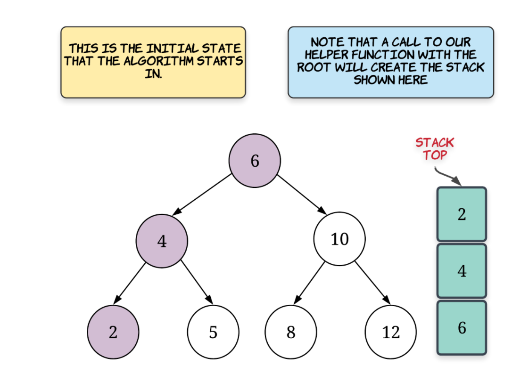

[Binary Search Tree Iterator - LeetCode](https://leetcode.com/problems/binary-search-tree-iterator/submissions/)  

flatten BST and 栈模拟dfs递归

# v1
flatten the BST, dfs  
使用array记录中序遍历的所有点。  
index控制下一个取哪个元素，空间O(n)。next() time :O(1)

# v2
- 使用栈模拟dfs递归（inorder)， 因为最小的元素是再最左边的叶子节点，所以我们只需要递归到该叶子节点（此时stack length equals to height of tree), next() call 直接pop出栈顶。

- 如果pop出来后还有右节点。则继续调用inorder函数入栈。

- hasNext() call just simply check out if the stack is empty or not.