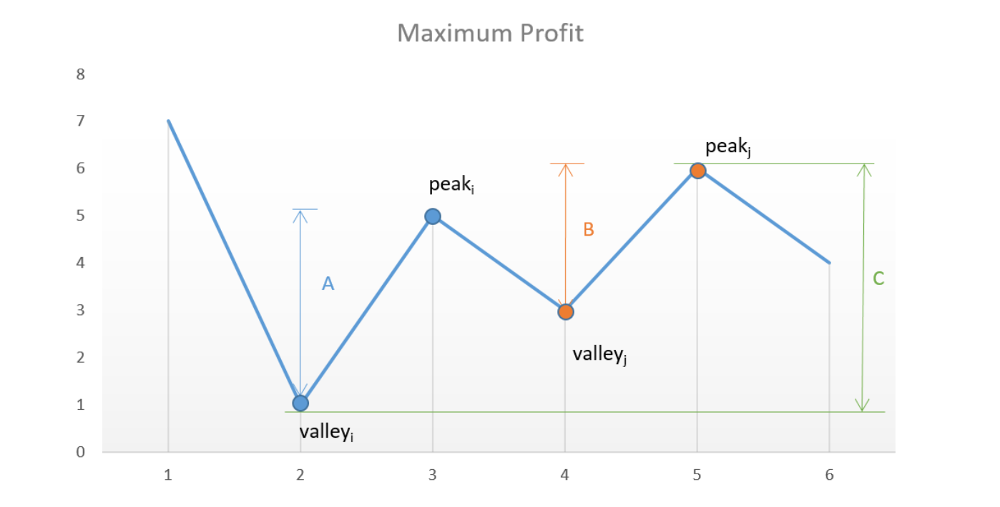

[Best Time to Buy and Sell Stock II - LeetCode](https://leetcode.com/problems/best-time-to-buy-and-sell-stock-ii/)

# v1 peak and valley
在1的基础上可以多次买卖股票，不过只能同时持有一支股票。  
在1的基础上使用山峰山谷法，每次使用while循环找到山峰和山谷，peak - valley, 就是部分最大的值。

# v2 one pass
只要后面的比前面的高，就可以实现一次买卖。相当于无限次买卖。