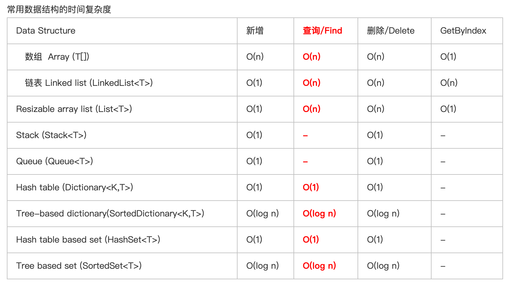

# hashMap:
如果对Hashtable的构造有很深的理解的话，就知道了，Hashtable 其实是综合了数组和链表的优点，当Hashtable对数值进行搜索的时候，首先用该数值与Hashtable的长度做了取模的操作，得到的数字直接作为hashtable中entry数组的index,因为hashtable是由entry数组组成的，因此，可以直接定位到指定的位置，不需要搜索，当然，这里还有个问题，每个entry其实是链表，如果entry有很多值的话，还是需要挨个遍历的，因此可以这样讲Hashtable的时间复杂度最好是O(1)但是最差是 O(n) 最差的时候也就是hashtable中所有的值的hash值都一样，都分配在一个entry里面，当然这个概率跟中1亿彩票的概率相差不大。

需要针对碰撞的时候做处理，HashMap 里面每一个数组(桶)里面存的其实是一个链表，key 的哈希冲突以后会追加到链表上面，这时候再通过 key 获取 value 的时候时间复杂度就变成了 O(n)，那么数据碰撞越来越多的时候岂不是查询很慢？最后呢为了优化这个时间复杂度，HashMap 当一个 key 碰撞次数超过 TREEIFY THRESHOLD 的时候就会把链表转换成红黑树，这样虽然插入的时候也增加了时间复杂度，但是对于频繁哈希碰撞的问题的查询效率有很大的提高，使得查询的时间复杂度变成了 O(logN)。
# 时间复杂度
1. 使用treeMap 和hashMap时间复杂度上的区别：（包括一些其他数据结构） 