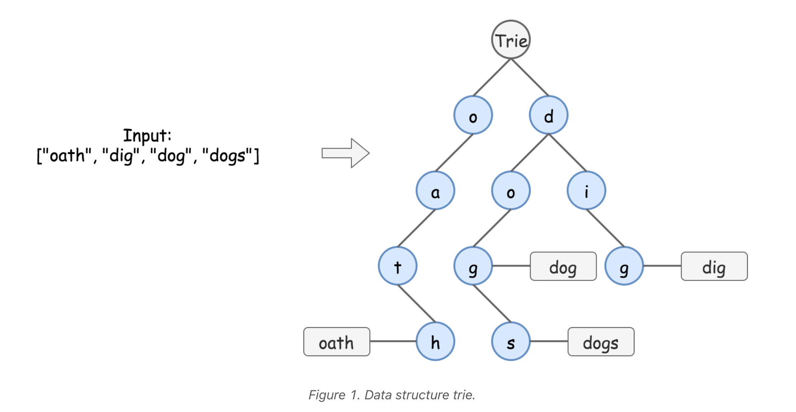

# Trie tree
Trie is widely used in real life: autocomplete search, spell checker, T9 predictive text, IP routing (longest prefix matching), some GCC containers.

Here is how it looks like


There are two main types of trie interview questions:  
1. Standard Trie. Design a structure to dynamically add and search strings, for example

   - Add and Search Word.

   - Word Search II.

   - Design Search Autocomplete System.

2. Bitwise Trie. Design a structure to dynamically add binary strings and compute maximum/minimum XOR/AND/etc, for example  

   - Maximum XOR of Two Number in an Array.
```java
class TrieNode {
    Map<Character, TrieNode> childrens = new HashMap<>(); // childrens of trie tree, key is the character, value is another TrieNode.
    boolean isWord = false; // isWord true means that a word ends by this character.
    public TrieNode(){}
}

public void addWord(String word) { // 字典树创建函数, time complexity: O(lenOfWord)
    TrieNode node = trie;
    for (char ch : word.toCharArray()) {
        if (!node.childrens.containsKey(ch)) {
            node.childrens.put(ch, new TrieNode());
        } 
            
        node = node.childrens.get(ch); // 下一个子节点
    }

    node.isWord = true; // 在结束的时候说明这是一个字的尾部，将其设为true
}
```