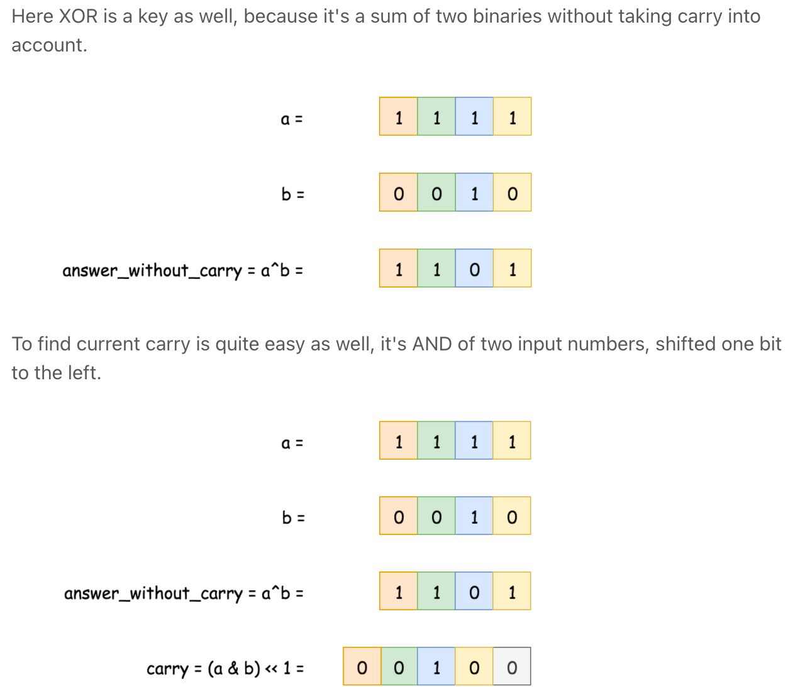
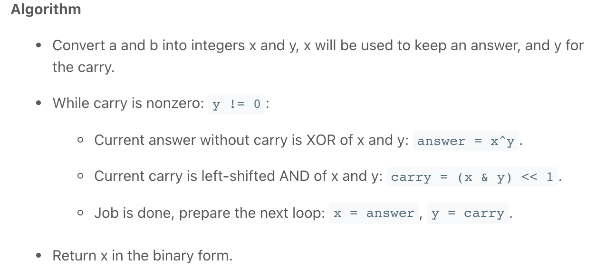

[Add Binary - LeetCode](https://leetcode.com/problems/add-binary/)
# v1: O(max(n, m))
- 要点1： 保证永远是一个长度大于另一个，后面的逻辑才不会出错。
- 2：二进制求和模板：
```java
int sum = (int)(a.charAt(ai) - '0') + (int)(b.charAt(bi) - '0') + carry; // sum 只有四个可能，0，1，2，3
ans = sum % 2 + ans; // 本位
carry = sum / 2; // 进位
ai--;
bi--;
```
- 3:在结束的时候别忘了carry可能还有值。

# v2: O(max(n, m))
v1 简洁写法，使用for循环控制两个指针。在循环内部判断指针是否大于等于0 决定加不加其中一个值。

本质还是一样，a + b + carry.

# v3: follow up, 不使用addition， 使用bit manipulation

循环进行上图的操作后，直到carry为0.
Now the problem is reduced: one has to find the sum of answer without carry and carry. It's the same problem - to sum two numbers, and hence one could solve it in a loop with the condition statement "while carry is not equal to zero".    
